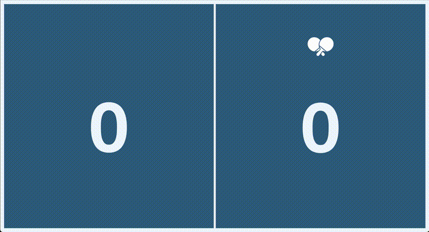

# Power-Up Pingis
Power-Up Pingis is a visual scoreboard for table tennis matches. It provides an interface to update the score using the technology of your own choice and updates the scoreboard using Socket.io. 

Development has been done using physical buttons on the side of the table to update but can be done with a touchscreen or the left/right arrow keys.

The scoreboard assumes that each player has two serves before moving to the other player and indicates which player has the current serve with racket icons on the screen.

## Start Power-Up Pingis

`node server/server.js` 

starts the app on [localhost:3000](http://localhost:3000)

Press right/left arrow keys to update score, hold down a few seconds to remove a disputed point. Up/down keys manually adjust how many serves each player has left.
